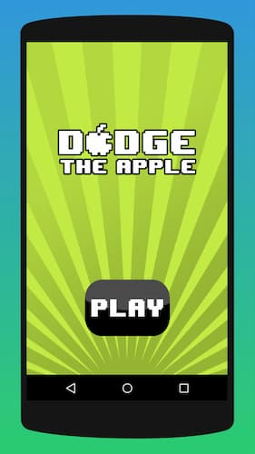
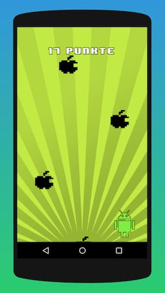
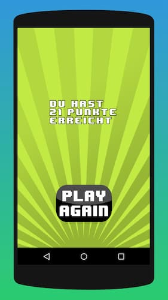

# Dodge The Apple

A simple game made with libGDX. This game was made during my studies for a university course in early 2016.

## Game instructions

The goal of the game is to avoid the falling apples. The longer the droid does not collide with an apple, the more points the player gets.  
The player can move the droid horizontally by tapping (and holding) on the left or right side of the screen.  
The longer the games lasts, the faster apples spawn.  
The game is over when the droid collides with an apple.

## Acknowledgements

Game Engine: 'libGDX'  
https://github.com/libgdx/libgdx

Font: '8 Bit Wonder' by Jorio Hatgaya  
https://www.dafont.com/de/8bit-wonder.font

The screenshots were made with the help of https://www.appstorescreenshot.com/
